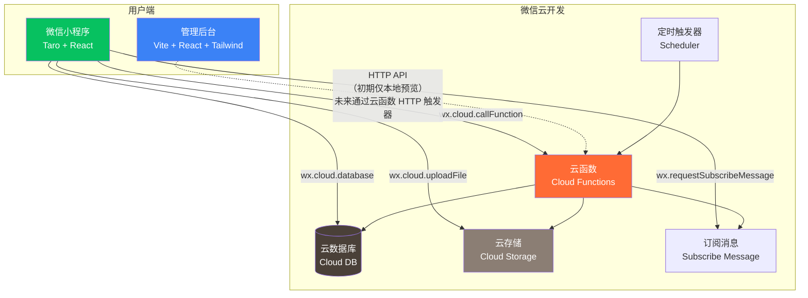
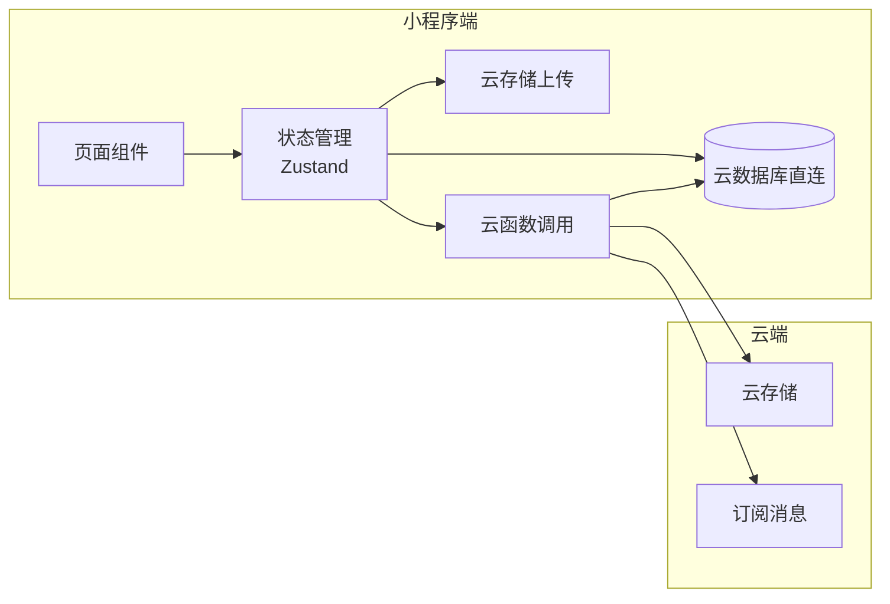
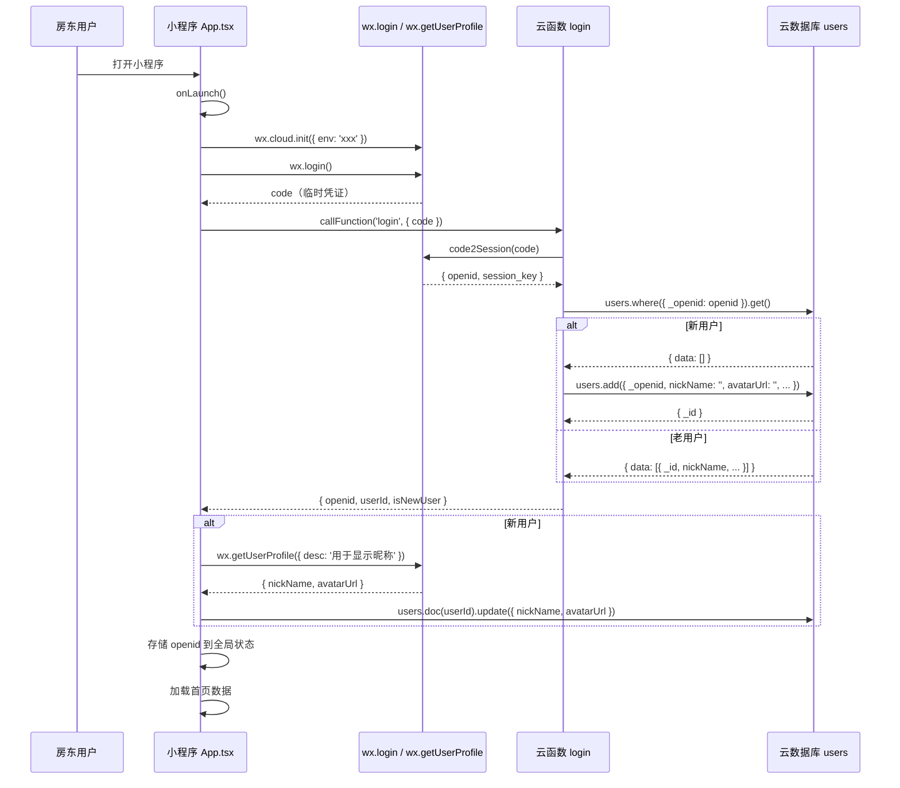
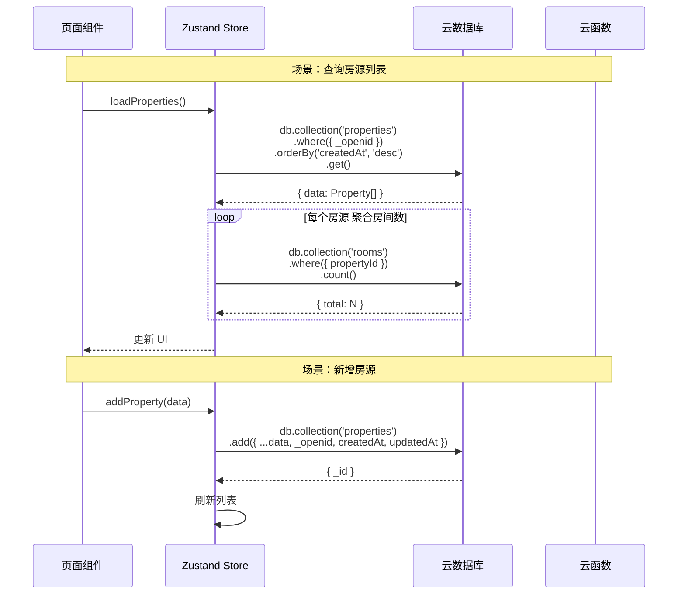
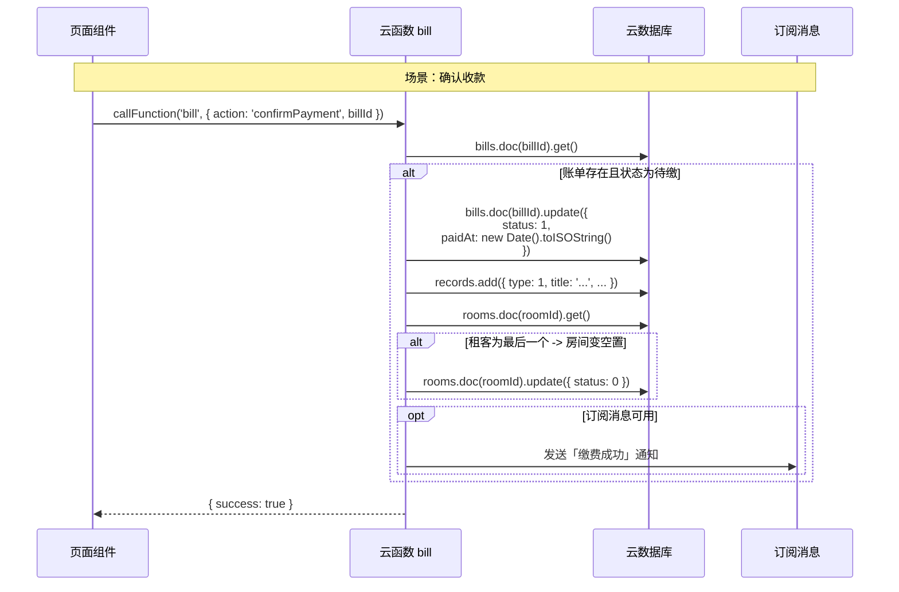
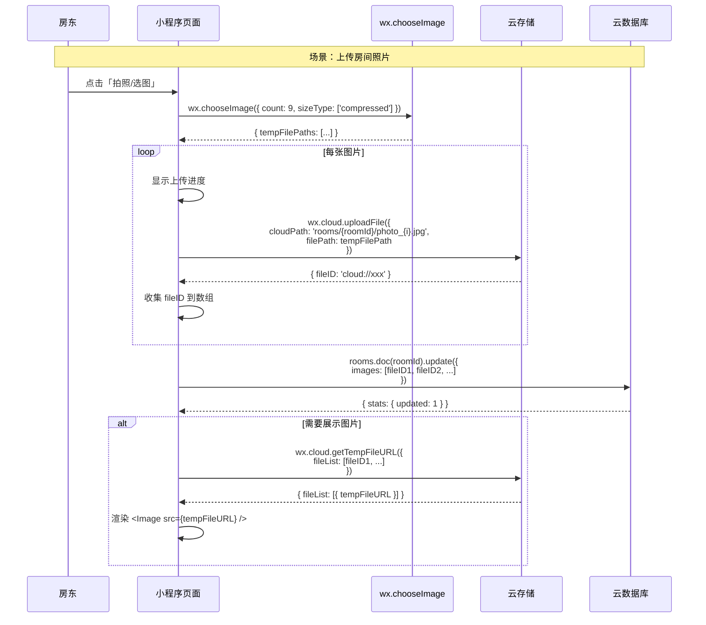
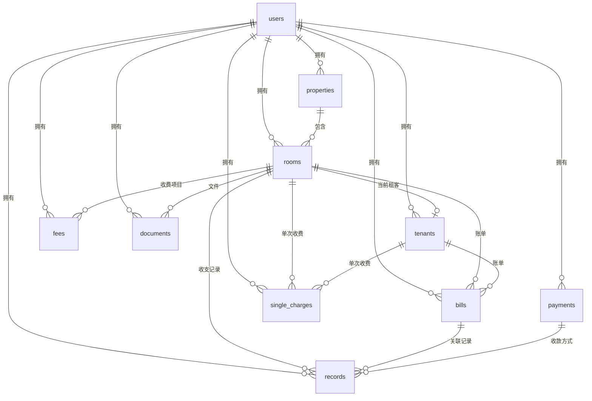

# 本地房东（Local Landlord）架构设计 V2

> **面向微信云开发的架构重设计**

| 版本 | 日期 | 作者 | 变更说明 |
|------|------|------|----------|
| V2.0 | 2026-06-04 | Bob (Architect) | 从 NestJS 自建后端迁移至微信云开发 |

---

## 1. 架构总览

### 1.1 技术选型表

| 层级 | 技术 | 说明 |
|------|------|------|
| **小程序前端** | Taro 4.x + React 18 | 跨端框架，当前已使用 |
| **管理后台** | Vite + React 18 + Tailwind CSS | 当前已使用 |
| **云数据库** | 微信云开发数据库 | JSON 文档型，类 MongoDB |
| **云存储** | 微信云开发存储 | 图片、合同、收据文件 |
| **云函数** | Node.js 18（微信云开发运行时） | 替代 NestJS 后端 |
| **登录鉴权** | `wx.login` + 云函数获取 OPENID | 静默登录，无感知 |
| **消息推送** | 微信订阅消息 | 收租日提醒、逾期通知 |
| **定时任务** | 云函数定时触发器 | 每日账单逾期检查 |
| **共享类型** | `packages/shared` | 前后端 + 云函数共享类型定义 |
| **包管理** | pnpm workspace (monorepo) | 保持不变 |

### 1.2 系统架构图



### 1.3 数据流总览



**核心原则**：
- 简单 CRUD 操作 → 小程序端直接操作云数据库（安全规则控制权限）
- 复杂业务逻辑（账单生成、统计聚合）→ 云函数
- 文件操作 → 云存储 + 云函数获取临时链接

---

## 2. 项目结构（Monorepo 调整）

```
local_landlord/
├── packages/
│   ├── miniapp/              # 小程序前端（保留，改造）
│   │   ├── src/
│   │   │   ├── app.tsx              # 入口，加入 wx.cloud.init() + 登录
│   │   │   ├── pages/               # 页面（不变）
│   │   │   ├── components/          # 组件（不变）
│   │   │   ├── services/
│   │   │   │   ├── db.ts            # 【新增】云数据库 DAO 层
│   │   │   │   ├── storage.ts       # 【新增】云存储服务
│   │   │   │   └── cloud.ts         # 【新增】云函数调用封装
│   │   │   ├── store/               # Zustand 状态管理（改造）
│   │   │   └── hooks/               # 自定义 Hooks
│   │   ├── config/
│   │   └── package.json
│   │
│   ├── admin/                # 管理后台（保留，后端接口改云函数 HTTP 触发器）
│   │   ├── src/
│   │   │   ├── services/
│   │   │   │   └── cloud-api.ts     # 【改造】从 axios → 云函数 HTTP 调用
│   │   │   └── ...
│   │   └── package.json
│   │
│   ├── server/               # NestJS 后端 → 【废弃】，保留为云函数参考代码
│   │   └── README.md                # 【新增】标注废弃原因
│   │
│   └── shared/               # 共享类型（保留，扩展）
│       └── src/
│           ├── types/               # 云数据库文档类型（适配 _id, _openid）
│           ├── constants/           # 枚举、错误码（不变）
│           └── utils/               # 工具函数（不变）
│
├── cloudfunctions/           # 【新增】云函数目录
│   ├── login/                # 微信登录
│   ├── property/             # 房源 CRUD（复杂操作）
│   ├── bill/                 # 账单生成、确认
│   ├── generateMonthlyBills/ # 定时任务：每月自动生成账单
│   ├── subscribeMessage/     # 订阅消息发送
│   └── admin/                # 管理后台聚合查询
│
├── pnpm-workspace.yaml
├── package.json
└── tsconfig.base.json
```

---

## 3. 云数据库集合设计

### 3.1 通用约定

- `_id`：微信云数据库自动生成的唯一 ID（string），替代原来的自增 `id: number`
- `_openid`：微信云数据库自动添加的用户标识（仅在权限为「仅创建者可读写」时）
- `createdAt` / `updatedAt`：ISO 8601 UTC 时间字符串
- 所有金额字段单位为**分**（整数），前端展示时 ÷ 100
- 文档级安全规则：用户只能读写自己的数据（通过 `_openid`）

### 3.2 集合定义

#### 3.2.1 `users` — 用户表

```typescript
interface User {
  _id: string;                    // 云数据库自动生成
  _openid: string;                // 微信 OPENID（自动）
  nickName: string;               // 微信昵称
  avatarUrl: string;              // 头像 URL
  phone?: string;                 // 手机号（可选，用于催租联系）
  createdAt: string;              // ISO 8601
  updatedAt: string;
  // 统计聚合字段
  propertyCount: number;          // 房源数
  roomCount: number;              // 房间数
  tenantCount: number;            // 租客数
}
```

**索引**：
- `_openid`：唯一索引（云开发自动）
- `createdAt`：普通索引

**权限**：仅创建者可读写

---

#### 3.2.2 `properties` — 房源表

```typescript
interface Property {
  _id: string;
  _openid: string;                // 所属房东
  name: string;                   // 房源名称（如「幸福小区3栋」）
  address?: string;               // 详细地址
  coverImage?: string;            // 封面图 cloud:// 格式永久链接
  note?: string;                  // 备注
  createdAt: string;
  updatedAt: string;
}
```

**索引**：
- `_openid`：普通索引
- `name`：普通索引

**权限**：仅创建者可读写

---

#### 3.2.3 `rooms` — 房间表

```typescript
interface Room {
  _id: string;
  _openid: string;
  propertyId: string;             // 关联 properties._id
  name: string;                   // 房间名称（如「301室」）
  rent: number;                   // 月租金（分）
  status: RoomStatus;             // 0=空置 1=已租
  deposit?: number;               // 押金（分）
  area?: string;                  // 面积
  floor?: string;                 // 楼层
  orientation?: string;           // 朝向
  facilities?: string[];          // 设施标签
  images?: string[];              // 房间照片 cloud:// 永久链接
  note?: string;
  createdAt: string;
  updatedAt: string;
}
```

**索引**：
- `_openid + propertyId`：复合索引
- `status`：普通索引

**权限**：仅创建者可读写

---

#### 3.2.4 `tenants` — 租客表

```typescript
interface Tenant {
  _id: string;
  _openid: string;
  roomId: string;                 // 关联 rooms._id
  name: string;                   // 租客姓名
  phone: string;                  // 手机号
  moveInDate: string;             // 入住日期 YYYY-MM-DD
  contractEndDate: string;        // 合同到期日 YYYY-MM-DD
  rentDay: number;                // 每月收租日（1-31）
  deposit?: number;               // 押金（分）
  note?: string;
  status: TenantStatus;           // 0=已退租 1=在租
  moveOutDate?: string;           // 退租日期
  createdAt: string;
  updatedAt: string;
}
```

**索引**：
- `_openid + roomId`：复合索引
- `status`：普通索引
- `contractEndDate`：普通索引（即将到期查询）

**权限**：仅创建者可读写

---

#### 3.2.5 `fees` — 收费项目模板

```typescript
interface FeeItem {
  _id: string;
  _openid: string;
  roomId: string;                 // 关联 rooms._id（空字符串 = 全局模板）
  name: string;                   // 费用名称
  type: FeeType;                  // 0=固定 1=手动输入
  amount?: number;                // 固定金额（分），手动输入时为空
  enabled: boolean;               // 是否启用
  isRent: boolean;                // 是否为租金项
  sortOrder: number;              // 排序
  createdAt: string;
  updatedAt: string;
}
```

**索引**：
- `_openid + roomId`：复合索引

**权限**：仅创建者可读写

---

#### 3.2.6 `bills` — 账单表

```typescript
interface Bill {
  _id: string;
  _openid: string;
  roomId: string;                 // 关联 rooms._id
  tenantId: string;               // 关联 tenants._id
  period: string;                 // 账期 YYYY-MM（如「2026-06」）
  totalAmount: number;            // 总金额（分）
  status: BillStatus;             // 0=待缴 1=已缴 2=逾期
  items: BillItem[];              // 账单明细（嵌入式数组）
  photos?: string[];              // 费用凭证照片
  sentAt?: string;                // 发送提醒时间
  paidAt?: string;                // 缴费确认时间
  createdAt: string;
  updatedAt: string;
}

interface BillItem {
  feeName: string;                // 费用名称（如「电费」）
  amount: number;                 // 金额（分）
}
```

> **设计说明**：BillItem 不使用独立集合，而是作为 Bill 的嵌入式数组。因为账单明细始终随账单一起读写，无需独立查询。

**索引**：
- `_openid + status`：复合索引
- `_openid + roomId`：复合索引
- `period`：普通索引
- `status`：普通索引

**权限**：仅创建者可读写

---

#### 3.2.7 `payments` — 收款码表

```typescript
interface PaymentQR {
  _id: string;
  _openid: string;
  type: PaymentQRType;            // 0=微信 1=支付宝 2=银行卡
  imageUrl: string;               // 收款码图片 cloud:// 永久链接
  isDefault: boolean;             // 是否默认
  payeeName: string;              // 收款人姓名
  note?: string;
  createdAt: string;
  updatedAt: string;
}
```

**索引**：
- `_openid`：普通索引

**权限**：仅创建者可读写

---

#### 3.2.8 `records` — 收支记录表

```typescript
interface RentRecord {
  _id: string;
  _openid: string;
  roomId: string;
  billId?: string;                // 关联账单（可选，单次收费时为空）
  type: RentRecordType;           // 0=账单发送 1=账单缴费 2=单次收费 3=单次缴费 4=催租提醒 5=逾期
  title: string;
  description?: string;
  amount?: number;                // 金额（分）
  createdAt: string;
}
```

**索引**：
- `_openid + createdAt`：复合索引（按时间倒序查询）
- `_openid + roomId`：复合索引

**权限**：仅创建者可读写

---

#### 3.2.9 `single_charges` — 单次收费表

```typescript
interface SingleCharge {
  _id: string;
  _openid: string;
  roomId: string;
  tenantId: string;
  feeType: string;                // 费用类型描述
  amount: number;                 // 金额（分）
  note?: string;
  status: 0 | 1;                  // 0=待缴 1=已缴
  paidAt?: string;
  createdAt: string;
}
```

**索引**：
- `_openid + status`：复合索引
- `_openid + roomId`：复合索引

**权限**：仅创建者可读写

---

#### 3.2.10 `documents` — 文件/合同表

```typescript
interface Document {
  _id: string;
  _openid: string;
  roomId: string;
  type: DocumentType;             // 0=合同 1=押金收据 2=租金收据 3=水电费 4=维修 5=其他
  name: string;
  imageUrl: string;               // cloud:// 永久链接
  note?: string;
  uploadedAt: string;
}
```

**索引**：
- `_openid + roomId`：复合索引
- `type`：普通索引

**权限**：仅创建者可读写

---

### 3.3 数据库安全规则总览

所有集合统一使用以下权限模型：

```json
{
  "read": "doc._openid == auth.openid",
  "write": "doc._openid == auth.openid"
}
```

> **说明**：每个房东用户只能读写自己的数据。管理后台通过云函数（有超级权限）跨用户查询。

---

## 4. 云存储目录结构

```
cloud://local-landlord-xxx/
├── properties/
│   └── {propertyId}/
│       └── cover.jpg                    # 房源封面
├── rooms/
│   └── {roomId}/
│       ├── photo_001.jpg                # 房间照片
│       └── photo_002.jpg
├── payments/
│   └── {userId}/
│       └── qr_wechat.jpg                # 收款码
├── bills/
│   └── {billId}/
│       └── receipt_001.jpg              # 账单凭证照片
├── documents/
│   └── {documentId}/
│       └── contract_xxx.jpg             # 合同/收据文件
└── avatars/
    └── {userId}/
        └── avatar.jpg                   # 用户头像
```

**命名规范**：
- 路径全小写，空格用下划线
- 文件名使用 `{类型}_{序号}.{扩展名}`
- 上传后的 cloud:// 永久链接写入对应集合的字段中

---

## 5. 登录流程

### 5.1 时序图



### 5.2 登录关键点

1. **静默登录**：`wx.login` 在 `app.tsx onLaunch` 自动执行，用户无感知
2. **OPENID 即用户标识**：无需手机号注册
3. **首次使用引导**：`isNewUser === true` 时展示引导页
4. **Session 管理**：云函数返回的 openid 存于全局状态，每次启动时刷新
5. **多设备同步**：同一 OPENID 登录不同设备，数据自动同步（云数据库特性）

---

## 6. 数据读写流程

### 6.1 小程序直连云数据库（简单 CRUD）



### 6.2 云函数处理复杂逻辑



---

## 7. 图片上传流程



**关键要点**：
- 上传后存 `fileID`（cloud:// 格式），不存 tempFilePath
- 展示时通过 `getTempFileURL` 获取临时链接（2 小时有效）
- 图片上传前压缩：`sizeType: ['compressed']`
- 上传失败处理：重试机制 + 错误提示

---

## 8. 云函数列表及职责

| 云函数名 | 触发方式 | 职责 | 入参示例 | 出参示例 |
|----------|----------|------|----------|----------|
| **login** | 小程序调用 | 微信静默登录，创建/查询用户 | `{ code: string }` | `{ openid, userId, isNewUser }` |
| **property** | 小程序调用 | 房源聚合查询（含房间数、在租数、空置数、月租金总和） | `{ action: 'list' \| 'detail', propertyId? }` | `{ properties: PropertyWithStats[] }` |
| **bill** | 小程序调用 | 账单生成、确认付款、批量催租 | `{ action: 'generate' \| 'confirm' \| 'remind', ... }` | `{ success, billId? }` |
| **generateMonthlyBills** | 定时触发器（每月1日 9:00） | 为所有在租房间自动生成当月账单 | 无 | `{ generated: number, failed: number }` |
| **subscribeMessage** | 小程序/定时调用 | 发送订阅消息（收租提醒、逾期通知） | `{ templateId, data, toUser }` | `{ success, errMsg? }` |
| **admin** | HTTP 触发器 / 管理后台调用 | 管理后台数据聚合（跨用户查询） | `{ action: 'dashboard' \| 'landlordList' \| 'stats', ... }` | `{ summary / list / stats }` |

### 8.1 云函数详细设计

#### `login` — 微信登录

```
输入：{ code: string }
处理：
  1. cloud.openapi.code2Session(code) → openid
  2. 查询 users 集合
  3. 新用户自动创建
输出：{ openid, userId, isNewUser, userInfo }
```

#### `property` — 房源管理

```
action='list'：返回房源列表 + 聚合统计
  → 对每个 property 执行 rooms.count({ propertyId, status: 1/0 })

action='detail'：返回房源详情 + 房间列表
  → 关联查询 rooms 集合
```

#### `bill` — 账单管理

```
action='generate'：为指定房间生成当月账单
  → 查询 room.feeItems → 计算总金额 → 写入 bills

action='confirm'：确认收款
  → 更新 bill.status=PAID → 写入 records → 检查是否需要更新 room.status

action='remind'：批量催租
  → 查询逾期/待缴账单 → 调用 subscribeMessage
```

#### `generateMonthlyBills` — 定时任务

```
触发：config.json → triggers [{ name: 'monthlyBills', type: 'timer', config: '0 0 9 1 * * * *' }]
处理：
  1. 查询所有 status=1（在租）的 tenants
  2. 遍历生成当月 period 的账单
  3. 去重：已有当月账单的房间跳过
输出：{ generated: N, skipped: M, failed: 0 }
```

#### `subscribeMessage` — 消息推送

```
输入：{ templateId, openid, data: { thing1, amount2, date3, ... }, page? }
处理：cloud.openapi.subscribeMessage.send(...)
输出：{ success: true/false, errMsg? }
```

#### `admin` — 管理后台

```
action='dashboard'：仪表盘统计
  → 聚合查询所有用户的 properties/rooms/tenants/bills 计数

action='landlordList'：房东列表
  → 分页查询 users 集合

action='stats'：数据统计
  → 聚合租金总额、入住率、逾期率等
```

---

## 9. 迁移计划（三阶段）

### 第一阶段：基础设施（预计 3-5 天）

| 任务 | 说明 |
|------|------|
| 创建云开发环境 | 注册环境 ID、初始化数据库、存储 |
| 新增 `cloudfunctions/login` | 实现登录云函数 |
| 改造 `app.tsx` | 添加 `wx.cloud.init()` + `onLaunch` 登录 |
| 新增 `services/db.ts` | 封装云数据库 CRUD 操作 |
| 新增 `services/storage.ts` | 封装云存储上传/下载 |
| 新增 `services/cloud.ts` | 封装云函数调用 |
| 改造 `packages/shared` | 类型适配（id: number → _id: string，新增 _openid） |
| **验证**：小程序启动 → 静默登录 → users 集合有数据 |

### 第二阶段：数据层替换（预计 5-7 天）

| 任务 | 说明 |
|------|------|
| 实现双写策略 | `localStorage` 保留作为缓存，云数据库为主存储 |
| 改造 Zustand Stores | 数据源从 `Taro.getStorageSync` → 云数据库 + localStorage 缓存 |
| 图片上传改造 | `tempFilePath` → 云存储永久链接 |
| 所有 CRUD 页面适配 | 逐一改造各页面数据读写逻辑 |
| **验证**：小程序重启后数据不丢失，图片正常展示 |

### 第三阶段：业务层升级（预计 5-7 天）

| 任务 | 说明 |
|------|------|
| 新增 `cloudfunctions/bill` | 账单生成、确认收款 |
| 新增 `cloudfunctions/generateMonthlyBills` | 定时自动生成账单 |
| 新增 `cloudfunctions/subscribeMessage` | 订阅消息推送 |
| 新增 `cloudfunctions/admin` | 管理后台数据接口 |
| 新增 `cloudfunctions/property` | 房源聚合查询 |
| 管理后台改造 | axios → 云函数 HTTP 调用 |
| 订阅消息集成 | 关键操作后引导用户订阅 |
| **验证**：完整业务流程走通（登录→加房→加租客→生成账单→确认收款） |

### 迁移完成后的清理

| 任务 | 说明 |
|------|------|
| 移除双写逻辑 | 删除 localStorage 数据同步代码 |
| 废弃 `packages/server` | 添加 README 标注废弃，保留为云函数参考 |
| 更新 CI/CD | 新增云函数部署脚本 |
| 文档更新 | 更新 README、部署文档 |

---

## 10. 依赖包列表

### 10.1 小程序端新增依赖

```
- wx-server-sdk@latest        # 云函数中调用云开发 API（开发依赖）
- @tarojs/plugin-cloud        # Taro 云开发插件（如果使用 Taro 云开发集成）
```

### 10.2 保持现有依赖

```
# packages/miniapp
- @tarojs/cli@4.x
- @tarojs/components
- @tarojs/plugin-framework-react
- react@^18.x
- zustand@^4.x
- taro-ui / NutUI（当前 UI 库，保持不变）

# packages/admin
- vite@^5.x
- react@^18.x
- tailwindcss@^3.x
- zustand@^4.x

# packages/shared — 无额外依赖
```

### 10.3 云函数运行时

云函数使用微信云开发内置的 Node.js 18 运行时，无需额外配置。每个云函数的 `package.json`：

```json
{
  "name": "cloudfunction-login",
  "version": "1.0.0",
  "dependencies": {
    "wx-server-sdk": "latest"
  }
}
```

> **注意**：云函数目录在 `cloudfunctions/` 下，**不属于 pnpm workspace**。每个云函数独立安装依赖，通过微信开发者工具或 CLI 上传部署。

---

## 11. 待确认问题

| # | 问题 | 优先级 | 建议 |
|---|------|--------|------|
| Q1 | 管理后台是否需要**同时支持**多个房东数据隔离？当前 admin 看起来是平台级管理后台 | P0 🔴 | 确认。若平台级 → 云函数 `admin` 需要跨用户查询权限；若单房东自用 → 可直接复用小程序逻辑 |
| Q2 | 云开发环境配额是否满足预期用户量？免费版有数据库容量（2GB）、存储（5GB）、云函数调用次数限制 | P0 🔴 | 建议初期使用免费版，商业化后升级配额 |
| Q3 | 管理后台是否需要部署到公网（正式域名）？还是仅用作本地管理工具？ | P1 🟡 | 若仅本地使用，可以不改造管理后台后端接口（保持 mock 数据）；若需公网，需配置云函数 HTTP 触发器 |
| Q4 | 订阅消息模板是否已申请？需要先在微信公众平台配置模板 | P1 🟡 | 需申请：收租提醒、缴费成功通知、逾期提醒 3 个模板 |
| Q5 | 是否需要数据导出功能（Excel/CSV）？中老年房东可能需要打印 | P2 🟢 | 可在云函数中实现，通过订阅消息发送下载链接 |
| Q6 | `packages/server` 中的 NestJS 代码是否全部废弃？部分业务逻辑可参考迁移到云函数 | P2 🟢 | 建议保留代码作为云函数实现的参考，标记为 DEPRECATED |
| Q7 | 是否需要离线模式？网络不好时中老年用户可能无法使用 | P2 🟢 | 建议在数据层使用 localStorage 缓存 + 云端同步策略（类似第一阶段双写） |

---

## 附录 A：集合关系图



---

## 附录 B：对比总结

| 维度 | 旧架构 (ARCHITECTURE.md) | 新架构 (V2) |
|------|--------------------------|-------------|
| 后端 | NestJS + TypeORM + MySQL | 微信云函数 + 云数据库 |
| 部署 | Docker + 服务器 | 无需部署，云开发即开即用 |
| 数据库 | MySQL（关系型） | 云数据库（文档型，类 MongoDB） |
| 用户标识 | 自建 JWT 鉴权 | 微信 OPENID |
| 文件存储 | 腾讯云 COS | 微信云存储 |
| 消息推送 | 需接入第三方 | 微信订阅消息 |
| 运维成本 | 服务器 + 数据库运维 | 零运维 |
| 费用 | 服务器月费 + COS + 带宽 | 云开发免费额度 > 按量付费 |
| 数据隔离 | landlordId 字段 | _openid 自动隔离 |
| ID 类型 | 自增 number | 自动生成 string（_id） |
```

---

## 变更日志

- **2026-06-04 V2.0**：从 NestJS 自建后端重构为微信云开发全栈方案
