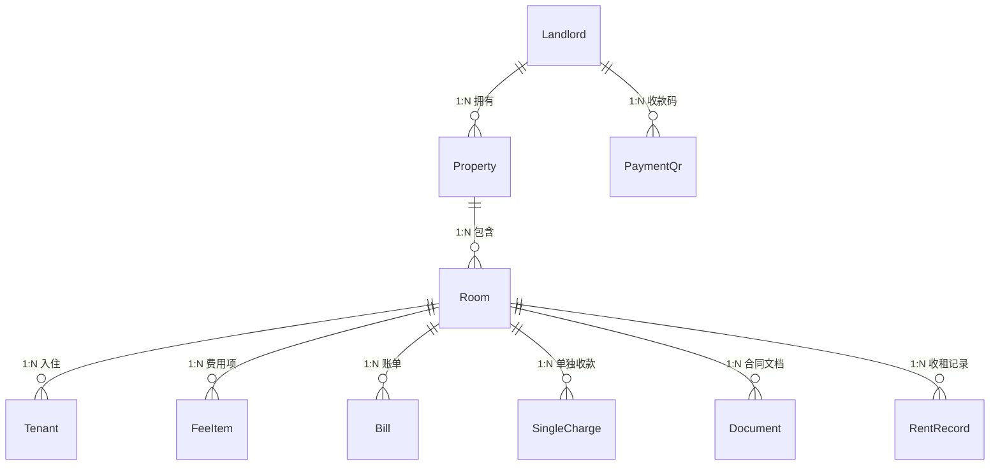
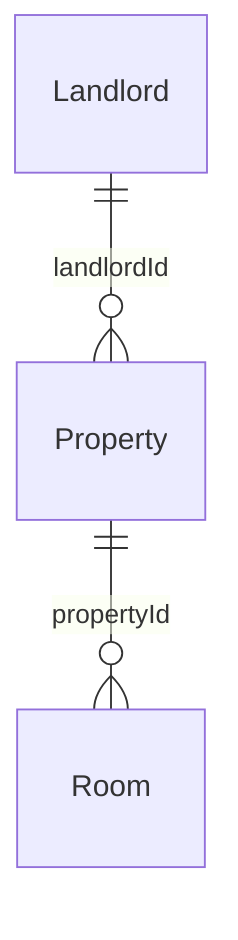
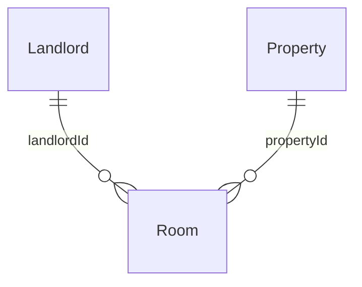
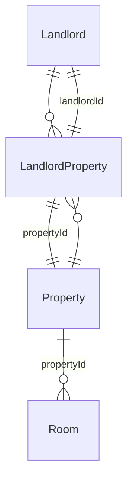

# 房间-房东-房源数据关系模型分析

> 作者：Bob (Architect)  
> 日期：2026-06-05  
> 任务：分析合租/合伙场景下数据模型的适配性，并对三种备选方案进行对比推荐

---

## 1. 当前数据模型确认

### 1.1 已读取的 Entity 源码

通过阅读 `packages/server/src/modules/` 下的 TypeORM Entity 定义，当前关系确认如下：

**Landlord** (`landlord.entity.ts`)：
- 主键 `id: number`（自增整型）
- 微信标识 `openId: string`（唯一）
- 基本字段：`name`, `phone`, `avatar`, `defaultPayeeName`, `paymentNote`
- 控制字段：`status`（0=禁用, 1=启用），`maxProperties`（默认10）
- **关系**：`@OneToMany(() => Property)` → 一个房东拥有多个房源

**Property** (`property.entity.ts`)：
- 主键 `id: number`
- 外键 `landlordId: number` → Landlord
- 基本字段：`name`, `address`, `coverImage`, `note`
- **关系**：`@ManyToOne(() => Landlord)` + `@OneToMany(() => Room)`

**Room** (`room.entity.ts`)：
- 主键 `id: number`
- 外键 `propertyId: number` → Property
- **没有 `landlordId` 字段，没有直接关联 Landlord**
- 基本字段：`name`, `rent`, `status`, `deposit`, `area`, `floor`, `orientation`, `facilities`, `images`, `note`
- **关系**：`@ManyToOne(() => Property)` + 多个 `@OneToMany`（Tenant, FeeItem, Bill, SingleCharge, Document, RentRecord）

### 1.2 关系图（ER）



### 1.3 关键代码上下文

**RoomService.create()** — 创建房间仅需 `propertyId`：
```typescript
async create(propertyId: number, dto: CreateRoomDto): Promise<Room> {
    const room = this.roomRepository.create({ ...dto, propertyId, status: 0 });
    return this.roomRepository.save(room);
}
```

**RoomService.findOne()** — 查房间详情通过 `property.landlord` 间接获取房东：
```typescript
const room = await this.roomRepository.findOne({
    where: { id },
    relations: ['property', 'property.landlord'],
});
```

**RoomController** — 所有房间 API 全部挂在房源路径下：
```typescript
@Get('properties/:propertyId/rooms')
@Post('properties/:propertyId/rooms')
@Get('rooms/:id')
@Put('rooms/:id')
@Delete('rooms/:id')
```

**V2 云数据库架构** — Room 集合有 `_openid`（直接标记所属房东）+ `propertyId`：
```typescript
interface Room {
  _id: string;
  _openid: string;      // ← 直接关联房东
  propertyId: string;    // ← 关联房源
  // ...
}
```

---

## 2. 核心问题分析：合租/合伙场景

### 2.1 场景描述

> 两个房东合伙出租同一套大房子，每人管理其中几个房间。

典型场景举例：
- 张阿姨和王阿姨共同拥有一栋三层小楼（一个 Property），张阿姨管1-2层，王阿姨管3层
- 兄弟二人继承一套大房子，各自出租其中部分房间

### 2.2 当前模型（模型A）能否覆盖？

**结论：不能直接覆盖。**

| 维度 | 当前模型的行为 | 问题 |
|------|---------------|------|
| 数据归属 | `Property.landlordId` 只能指向一个房东 | 第二个房东无法"拥有"该房源 |
| 房间归属 | Room 通过 `Property → Landlord` 间接关联 | 同一房源下不同房间无法归属不同房东 |
| 数据隔离 | 查询通过 landlordId → properties → rooms | 第二个房东看不到同一房源下"自己管"的房间 |
| 操作权限 | 房间的 CRUD 需要先验证 property.landlordId | 第二个房东无权操作 |

**变通方案（当前模型下的 workaround）**：
- 两个房东各自创建一个同名 Property（如"幸福里2号楼"），各自管理自己的房间
- 缺点：两份数据，统计分散，房源信息重复

---

## 3. 三种模型对比

### 3.1 模型A：Landlord 1:N Property 1:N Room（当前）

```
Landlord ──1:N──> Property ──1:N──> Room
```



| 维度 | 评价 |
|------|------|
| **简单度** | ⭐⭐⭐⭐⭐ 极简，一条直线 |
| **合租场景** | ❌ 不支持 |
| **查询效率** | 查某房东所有房间需2次JOIN（landlord→properties→rooms） |
| **数据一致性** | ⭐⭐⭐⭐⭐ 无冗余，Room 的房东从 Property 推导 |
| **与 PRD 一致性** | ⭐⭐⭐⭐⭐ 完美匹配（房源→房间→租客层级） |
| **V2 云架构兼容性** | ⚠️ 云架构已加 `_openid` 在 Room 上，形成部分冗余 |

### 3.2 模型B：Landlord 1:N Room + Room N:1 Property

```
Landlord ──1:N──> Room
Room ──N:1──> Property
```



**Entity 变化**：
```typescript
// Room 新增字段
@Column({ name: 'landlord_id', type: 'integer' })
landlordId: number;

@ManyToOne(() => Landlord)
@JoinColumn({ name: 'landlord_id' })
landlord: Landlord;

// Property.landlordId 保留（用于"房源主理人"概念）
```

| 维度 | 评价 |
|------|------|
| **简单度** | ⭐⭐⭐ 中等，Room 多一个 FK |
| **合租场景** | ✅ 部分支持（同房源不同房间可归属不同房东） |
| **查询效率** | ⭐⭐⭐⭐ 查某房东所有房间：1次 JOIN |
| **数据一致性** | ⚠️ Room.landlordId 可能与 Room.property.landlordId 不一致 |
| **与 PRD 一致性** | ⚠️ PRD 中 Room 没有 landlordId 字段，所有页面按 Property→Room 导航 |
| **V2 云架构兼容性** | ⭐⭐⭐⭐ 与云架构的 `_openid` + `propertyId` 设计一致 |
| **迁移成本** | 中等：加字段、改 Service、改 Controller |

**关键问题**：
- Property.landlordId 含义变模糊：是"房源创建者"还是"房源所有者"？
- 当 Room.landlordId ≠ Property.landlordId 时，数据隔离/权限校验逻辑变得复杂

### 3.3 模型C：Landlord N:M Property + Property 1:N Room

```
Landlord ──N:M──> Property ──1:N──> Room
（加 landlord_property 中间表）
```



**新增表**：
```typescript
@Entity('landlord_property')
export class LandlordProperty {
  @PrimaryGeneratedColumn()
  id: number;

  @Column({ name: 'landlord_id' })
  landlordId: number;

  @Column({ name: 'property_id' })
  propertyId: number;

  @Column({ length: 32, default: 'owner' })
  role: string; // owner / manager / viewer
}
```

| 维度 | 评价 |
|------|------|
| **简单度** | ⭐⭐ 较复杂，多了中间表 |
| **合租场景** | ✅ 完整支持（多房东共享房源，可设角色） |
| **查询效率** | ⭐⭐ 查房东的房间需3次 JOIN |
| **数据一致性** | ⭐⭐⭐ 中间表维护成本较高 |
| **与 PRD 一致性** | ❌ PRD 无任何多房东概念 |
| **V2 云架构兼容性** | ❌ 云架构本质是单租户（`_openid` 即用户），完全没有多房东设计 |
| **迁移成本** | 🔴 极高：改表结构、改所有查询、改权限逻辑、改 UI |

---

## 4. 推荐方案

### 🏆 推荐：模型A（当前模型），不做结构性变更

### 4.1 推荐理由

#### 理由一：中老年房东场景不需要合租模型

| 事实 | 来源 |
|------|------|
| 目标用户是 50-70 岁中老年房东 | PRD §2.2 |
| 预期持有 1-10 套房源 | PRD §2.2 |
| "多房东协作"是 Open Question，不是需求 | PRD §18-Q6 |
| 整个 PRD 1760+ 行，未出现任何"合伙""共享房源""多房东"功能设计 | 全文检索 |
| UI 强调"大字体、大按钮、步骤引导"降低门槛 | PRD §2.3 |

**结论**：为一个未确认的、低频的边缘场景（合伙出租）引入模型复杂度，违背产品"简单"的核心定位。

#### 理由二：V2 云架构已经隐含冗余优化

ARCHITECTURE_V2.md 已经给 Room 集合加了 `_openid` 字段。这意味着：
- 在 SQLite/TypeORM 层保持 `Property → Room` 的纯粹层级
- 在云数据库层通过 `_openid` 实现直接查询（"我的所有房间"）
- 两层各自最优，无需在 TypeORM 层做冗余

如果要优化"查某房东所有房间"的性能，在云架构中直接用 `rooms.where({ _openid })` 即可。

#### 理由三：PRD 100% 对齐

PRD §4.1 所有操作路径都遵循 `房源 → 房间 → 详情`：
```
房源列表(page-rooms) → 房间列表(page-room-list?propertyId=xxx) → 房间详情(page-room-detail?roomId=xxx)
```

PRD §5.4 路由参数规格中，所有房间相关页面传 `propertyId` 或 `roomId`，没有任何页面传 `landlordId` 作为房间查询条件。

改变数据模型意味着需要重新设计所有页面交互流程，迁移成本极高。

#### 理由四：用"逻辑方案"而非"结构方案"解决合租

如果未来确实遇到合伙出租需求，推荐以下低成本方案：

| 方案 | 描述 | 成本 |
|------|------|------|
| **同名房源法** | 两个房东各自创建同名 Property，各自管理自己的房间 | 零开发成本 |
| **委托管理** | 一个房东创建房源+所有房间，另一个房东通过管理员后台查看 | 低（仅需后台权限调整） |
| **功能引导** | 在产品中加说明"一套房源绑定一个房东，如需共享请各自创建" | 极低 |

---

## 5. 关于用户原始诉求的回应

> 用户提出："房间管理应该先归属于房东然后挂房源"

**理解用户意图**：用户可能觉得当前"先选房源再看到房间"的操作路径不够直接，希望有一个"我所有的房间"的全局视图。

**但这不是数据模型问题，而是 UI/查询问题。**

### 5.1 建议：增加"全部房间"聚合视图，但不改数据模型

```
房源列表页 (page-rooms)
├── 新增"全部房间"Tab/入口
│   └── 跨房源聚合，查询：SELECT * FROM room WHERE property_id IN (SELECT id FROM property WHERE landlord_id = ?)
├── 原有房源卡片（保持不变）
```

这样：
- 用户可以选择"按房源看"（现有流程）
- 也可以选择"看所有房间"（新增快捷入口）
- 底层数据模型不变

### 5.2 V2 云架构中这已天然支持

```typescript
// 直接查当前房东所有房间
db.collection('rooms')
  .where({ _openid: currentOpenId })
  .get()
```

---

## 6. 迁移影响总结

由于推荐模型A（不做变更），无数据迁移需求。

如果团队决定采用模型B（不推荐），迁移步骤如下：

| 步骤 | 操作 | 影响范围 |
|------|------|----------|
| 1 | Room 表加 `landlord_id` 列，设默认值为 NULL | 数据库 Migration |
| 2 | 回填数据：`UPDATE room SET landlord_id = (SELECT landlord_id FROM property WHERE property.id = room.property_id)` | 一次性脚本 |
| 3 | Room Entity 加 `@Column + @ManyToOne(Landlord)` | server entity |
| 4 | CreateRoomDto 加 `landlordId` 字段 | server dto |
| 5 | RoomService.create() 赋值 landlordId | server service |
| 6 | RoomController 加 `/landlords/:landlordId/rooms` 路由 | server controller |
| 7 | 共享类型 Room 接口加 `landlordId` | shared/types |
| 8 | 小程序端新增"全部房间"页面/组件 | miniapp |
| 9 | 权限校验改 `room.property.landlordId` → `room.landlordId` | server guard |
| 10 | V2 云数据库 Room 接口同步加 `landlordId` | cloudfunctions |

**预估工作量**：3-5 人天。风险：回填 SQL 时可能有不一致数据。

---

## 7. 总结

| 问题 | 答案 |
|------|------|
| 当前模型能否覆盖合租场景？ | **不能**，但合租场景不是已确认需求 |
| Room 与 Landlord 当前是否有直接关联？ | **没有**，通过 `Room → Property → Landlord` 间接关联 |
| 推荐模型 | **模型A（当前）**，保持不变 |
| 是否需要数据迁移？ | **不需要** |
| 如何满足用户"房间先归属于房东"的诉求？ | 通过 UI 层"全部房间"聚合视图，不改数据模型 |

### 决策矩阵

| 方案 | 复杂度 | 合租支持 | 查询效率 | PRD对齐 | V2兼容 | 迁移成本 | **综合推荐** |
|------|:---:|:---:|:---:|:---:|:---:|:---:|:---:|
| A（当前）| ⭐⭐⭐⭐⭐ | ❌ | ⭐⭐⭐ | ⭐⭐⭐⭐⭐ | ⭐⭐⭐⭐ | 零 | **✅ 推荐** |
| B（Room+landlordId）| ⭐⭐⭐ | ⚠️ 部分 | ⭐⭐⭐⭐ | ⭐⭐⭐ | ⭐⭐⭐⭐ | 中 | ❌ |
| C（N:M 中间表）| ⭐⭐ | ✅ | ⭐⭐ | ⭐ | ⭐ | 高 | ❌ |

---

*以上分析基于 `packages/server/src/modules/` 下所有 entity 源码、`ARCHITECTURE_V2.md` 云架构、`PRD.md` 产品需求文档的完整阅读。*
